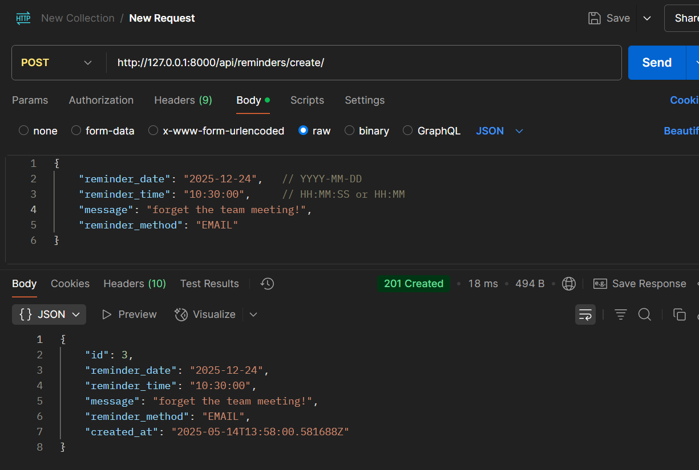

Assignment Symplique Solutions

Project: Remind-me-later

This web app does one thing and one thing well. It allows users to setup a reminder with a message. The JS developers have gone ahead and created a nice UI to accept date and time, to know when to send the message, and the actual text message to send. They have also given an option to select how to remind. Right now the app support reminding through SMS and Email. Going forward the app might support other ways to send the reminder.

Now the JS devs need an API to call to save the state to the db. Design and implement an API endpoint using django for the above requirement. If you are not familiar with Django, please use another Python framework for creating this endpoint. Please note that you do not need to take care of actual message delivery logic. You are only required to create an endpoint which accepts these datapoints: date, time and message and store the info in database.

Solution : 
Created a custom end point to receive and store the desired data through Rest-Api.
Tested the endpoint using PostMan.
Improvements  That can be done : To convert the date and time into single field to managetime zones as well.

Screenshot

